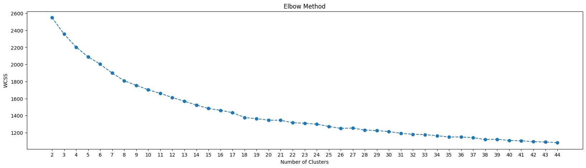
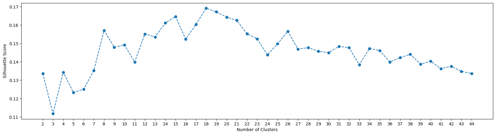
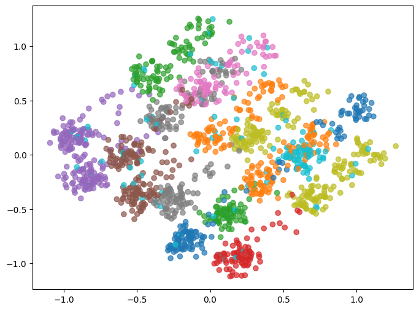
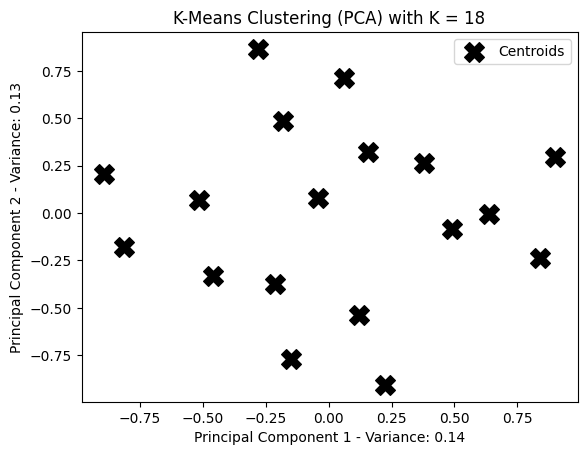
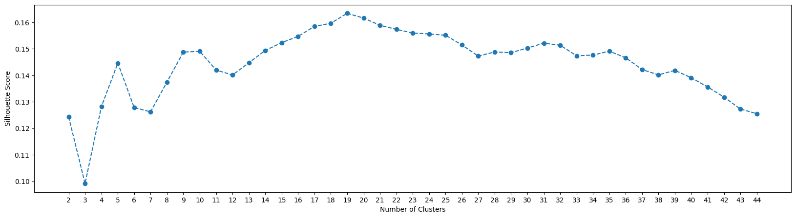
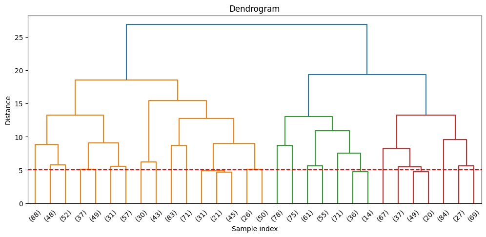

# Clustering for Patient Segmentation

**Machine Learning Final Project** — CSB Class, Universitas Gadjah Mada

## Team Members


| Name                   |
| ---------------------- |
| Yusuf Imantaka Bastari |
| Muhammad Javier        |
| Khrisna Dwi Haryanto   |


## Project Overview

This project delivers a data-driven approach to one of healthcare's most persistent challenges: treating every patient the same. By applying unsupervised clustering to 2,000 real patient records, we produce actionable patient personas that can directly inform care delivery, resource planning, and engagement strategies.

By rigorously comparing K-Means and Hierarchical Clustering and validating with multiple evaluation metrics, this project produces a reusable segmentation pipeline — one that could scale to larger hospital systems or be extended with additional variables such as lifestyle data or treatment history.

## Objectives

1. **Segment** 2,000 patients into meaningful personas using demographics, health metrics, healthcare utilization, and insurance data.
2. **Compare** K-Means and Hierarchical Clustering to identify the most actionable and interpretable patient groupings.
3. **Determine** the optimal number of clusters using quantitative validation techniques (Elbow Method and Silhouette Score).
4. **Visualize and interpret** each cluster in terms of dominant patient characteristics such as age group, chronic condition burden, visit frequency, and insurance type.
5. **Evaluate** how each clustering method supports real-world decisions around resource allocation, preventive care targeting, and patient engagement.

## Problem Statement

Healthcare providers serve diverse patient populations — varying by age, insurance type, chronic conditions, and engagement levels — yet most are treated under the same protocols. Without segmentation, providers cannot identify who needs preventive intervention, who is at risk of disengagement, or where to allocate resources efficiently. Care delivery remains reactive, marketing stays generic, and resources are wasted.

> *"The gap between data we already collect and the insight we extract from it represents an untapped opportunity in preventive care."*


| Without Segmentation              | With Segmentation                    |
| --------------------------------- | ------------------------------------ |
| Same outreach for all patients    | Targeted campaigns per patient group |
| Reactive resource allocation      | Proactive, needs-based planning      |
| Low preventive care participation | Higher engagement and retention      |
| High cost, poor outcomes          | Optimized spend, better satisfaction |


## Dataset

**Source:** [Patient Segmentation Dataset — Kaggle](https://www.kaggle.com/datasets/nudratabbas/patient-segmentation-data) (2,000 patient records)


| Feature                  | Type        | Description                                  |
| ------------------------ | ----------- | -------------------------------------------- |
| `PatientID`              | String      | Unique patient identifier                    |
| `Age`                    | Integer     | Patient age                                  |
| `Gender`                 | Categorical | Male / Female                                |
| `State`                  | Categorical | U.S. state                                   |
| `City`                   | Categorical | City of residence                            |
| `Height_cm`              | Integer     | Height in centimeters                        |
| `Weight_kg`              | Integer     | Weight in kilograms                          |
| `BMI`                    | Float       | Body Mass Index                              |
| `Insurance_Type`         | Categorical | Private / Medicare / Medicaid                |
| `Primary_Condition`      | Categorical | Primary medical condition                    |
| `Num_Chronic_Conditions` | Integer     | Number of chronic conditions                 |
| `Annual_Visits`          | Integer     | Number of visits per year                    |
| `Avg_Billing_Amount`     | Float       | Average billing amount                       |
| `Last_Visit_Date`        | Date        | Date of last visit                           |
| `Days_Since_Last_Visit`  | Integer     | Days since last visit                        |
| `Preventive_Care_Flag`   | Binary      | Whether the patient received preventive care |


## Methodology

### 1. Data Preprocessing

- Drop unnecessary columns (e.g., `PatientID`).
- Encode categorical variables.
- Extract features from date-time columns.
- Normalize numerical features (Age, BMI, Billing Amount, Visit Frequency) using Min-Max Scaling or Z-score.

### 2. Dimensionality Reduction

- Apply PCA (Principal Component Analysis) to reduce features to 2–3 dimensions for visualization purposes.
- PCA is used for plotting only; clustering is performed on the full normalized feature set.

### 3. Clustering Methods

- **K-Means Clustering** — Partition-based clustering with Elbow Method for optimal *k*.
- **Hierarchical Clustering** — Agglomerative clustering with dendrogram analysis.
- **Evaluation** — Silhouette Score for cluster quality validation.

### 4. Cluster Interpretation

- Profile each cluster by computing the mean values of all clinical features per cluster.
- Assign descriptive patient persona labels (e.g., *High-Risk Seniors*, *Young Healthy Adults*, *Chronic Disease Patients*) based on dominant cluster features.

## Expected Deliverables

- A Jupyter Notebook containing all preprocessing, modeling, and visualization code.
- A comparative analysis of K-Means vs. Hierarchical Clustering results, including cluster quality metrics.
- Visualizations: elbow curve, silhouette plot, dendrogram, PCA scatter plots, per-cluster feature profiles, and patient persona radar charts.
- A final written report summarizing findings, cluster interpretations, and healthcare utilization and engagement implications.
- Recommendations on which clustering approach is more suitable for patient segmentation.

## Project Structure

```
patient_segmentation_project/
├── clustering.ipynb                  # Data Cleaning and Clustering Source Code
├── patient_segmentation_dataset.csv  # Dataset
├── figures/                          # Result figures
├── README.md
└── .gitignore
```

## Getting Started

### Prerequisites

- Python 3.12+
- Jupyter Notebook / JupyterLab

### Installation

```bash
python -m venv .venv
source .venv/bin/activate
pip install pandas matplotlib scikit-learn scipy
```

### Running

```bash
jupyter notebook clustering.ipynb
```

## Results

### K-Means Clustering

The Elbow Method and Silhouette Score are used to find the optimal number of clusters. The best k by Silhouette Score is **18**.









### Hierarchical (Agglomerative) Clustering

The best k by Silhouette Score is **19**.





### Analysis

Both methods produce a large number of clusters with low silhouette scores. The full analysis is in `clustering.ipynb`.

## References

- [Patient Segmentation Dataset](https://www.kaggle.com/datasets/nudratabbas/patient-segmentation-data), Kaggle
- Scikit-learn documentation: https://scikit-learn.org

## License

This project is for academic purposes at Universitas Gadjah Mada.